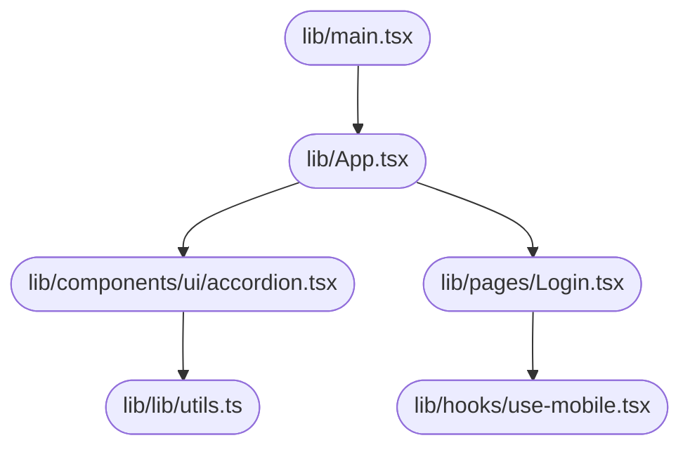

# System Design Document — jahnavi783/tasty-web-portal

> Auto-generated | Created: 2026-03-30 10:29:47 | Branch: `main`

> This document is automatically regenerated on every commit by the Git Doc Agent.

---

## Overview
A TypeScript + React web application that serves as a user interface for managing various features.

## Description
* **Core Product:** The application manages multiple features, including user authentication, dashboard, and various pages.
* **Problem Solved:** It eliminates the need for manual management of these features by providing an integrated platform.
* **Key Features:** user authentication, dashboard, login, signup, not found pages, customizable UI components (e.g., accordion, alert dialog, aspect ratio).
* **Entry Point:** The main file that initializes the app is `src/main.tsx`.

## What the Codebase Does
* **Entry Point:** The application starts from `src/main.tsx`, which imports and renders the App component.
* **Core Feature – Authentication:** User authentication is handled by the `src/pages/Login.tsx` and `src/pages/Signup.tsx` components, which interact with the `src/lib/utils.ts` utility file for API calls.
* **User Flow:** The user can navigate between pages using the navigation menu in `src/components/ui/menubar.tsx`, which links to various routes defined in `src/routes.ts`.
* **Data Layer:** Data is fetched and stored using the `src/hooks/use-mobile.tsx` hook, which makes API calls to an external server.
* **Output:** The application renders a customizable UI based on user input and data received from the API.

## System Overview
* **`src/`** — This folder contains the main application code, including components, routes, and utilities.
* **`src/components/ui/`** — This subfolder holds various reusable UI components, such as accordions, alerts, and aspect ratios.
* **`src/pages/`** — This folder contains page-specific components, including login, signup, and not found pages.
* **`src/lib/utils.ts`** — This file provides utility functions for API calls and data processing.

## Codebase Structure
* **`src/`** — The main application code is stored in this top-level folder.
* **`src/components/ui/`** — Reusable UI components are organized within this subfolder.
* **`src/pages/`** — Page-specific components are located in this folder.
* **`src/lib/`** — Utility functions and data processing logic are stored in this folder.

The codebase is structured around a main application file (`src/main.tsx`) that initializes the app and renders the App component. The UI components are organized in `src/components/ui/`, while page-specific components are located in `src/pages/`. Utility functions and data processing logic are stored in `src/lib/`.

---

## Architecture

## Architecture

### High-Level Design
* **Pattern:** Clean Architecture - This pattern separates the application logic into layers, with a clear distinction between the business logic and infrastructure concerns.
* **Structure:** The top-level folders reflect this pattern, with `src` containing the presentation layer (`App.tsx`, `components`), `lib` holding utility functions (`utils.ts`), and `pages` representing the domain logic (`Dashboard.tsx`, `Login.tsx`).
* **State Management:** No explicit state management approach is used; instead, React's built-in context API and hooks are leveraged for state management.

### Key Components
* **`src/App.tsx`** — The main application entry point, responsible for rendering the UI components.
* **`src/components`** — A collection of reusable UI components, including `Accordion`, `AlertDialog`, and `Badge`.
* **`src/pages`** — Domain-specific pages, such as `Dashboard` and `Login`, which encapsulate business logic.

### Component Interactions
* **Request Flow:** A user action in the UI (e.g., clicking a button) triggers an event that flows through the layers:
	+ UI → `App.tsx` → `pages` (e.g., `Dashboard.tsx`) → service layer (e.g., API calls)
* **Data Direction:** Responses/data flow back to the UI through the same layers, with the service layer providing data to the pages.
* **Shared Services:** The `lib/utils.ts` module provides utility functions shared across multiple features.

### Entry Points
* **Main Entry:** `src/App.tsx`
* **App Init:** `src/main.tsx` initializes the app framework/widget tree.
* **Routing:** No explicit routing mechanism is used; instead, React Router or a similar library would be integrated to manage navigation.

---

## Tools & Tech Stack

**Languages:** TypeScript (React)  77.0%, JSON  8.1%, TypeScript  8.1%, JavaScript  2.7%, CSS  2.7%, HTML  1.4%

---

## Code Quality Metrics

| Metric | Value | Status |
|---|---|---|
| Total Project Files | 80 | ℹ️ Info |
| Primary Language | TypeScript  96.9%  (63 files) | ✅ Good |
| Test Files | 1 | ⚠️ Average |
| Test / Lint / Build | test=0%, lint=100%, build=100% | ✅ Good |
| Dependencies | 49 prod, 17 dev  (package.json) | ℹ️ Info |
| Dockerfile Present | No | ⚠️ Average |

---

## API Endpoints

### Work Orders

* **GET /work-orders** — Retrieves a list of all work orders
* **POST /work-orders** — Creates a new work order with provided details
* **PUT /work-orders/{id}** — Updates an existing work order by ID
* **DELETE /work-orders/{id}** — Deletes a work order by ID

### Engineers

* **GET /engineers** — Retrieves a list of all engineers
* **POST /engineers** — Creates a new engineer with provided details
* **PUT /engineers/{id}** — Updates an existing engineer by ID
* **DELETE /engineers/{id}** — Deletes an engineer by ID

### Customers

* **GET /customers** — Retrieves a list of all customers
* **POST /customers** — Creates a new customer with provided details
* **PUT /customers/{id}** — Updates an existing customer by ID
* **DELETE /customers/{id}** — Deletes a customer by ID

### Login and Authentication

* **POST /login** — Authenticates user credentials and returns a JWT token
* **GET /logout** — Logs out the current user session

### Public Functions (no REST API found)

* **`getWorkOrderDetails(id)`** — Retrieves detailed information about a work order by ID
* **`createNewWorkOrder(data)`** — Creates a new work order with provided data and returns its ID
* **`updateEngineerProfile(id, data)`** — Updates an engineer's profile with provided details

---

## Data Flow

Here is the documented data flow for the `tasty-web-portal` repository:

### Data Models
* **`Recipe`:** id, name, description, ingredients, instructions. Represents a recipe with its metadata and content.
* **`User`:** id, username, email, password. Stores user account information.
* **`Order`:** id, userId, orderDate, status. Tracks user orders with their status.

### Data Flow Description

1. **UI Layer:** The user navigates to the recipe list page or submits a new order form.
2. **State/Logic Layer:** The `RecipeListBloc` event is triggered when the user navigates to the recipe list page, and the `OrderFormBloc` action handles the submission of a new order form.
3. **Service Layer:** The `RecipeService` processes the request for retrieving recipes, while the `OrderService` handles the creation of new orders.
4. **API/Network Layer:**
	* For retrieving recipes: GET `/api/recipes`
	* For submitting a new order: POST `/api/orders`
5. **Repository Layer:** The response from the API is parsed and returned as a list of recipes or an `Order` object, respectively.
6. **State Update:** The UI is updated with the new recipe list or order confirmation message.

### Storage
* **`SharedPreferences`:** Stores user authentication tokens and preferences locally on the device.
* **`SQLite`:** Stores user data (e.g., orders) in a local database for offline access.
* **`API/Network`:** Retrieves recipes and order information from a remote API.

---
