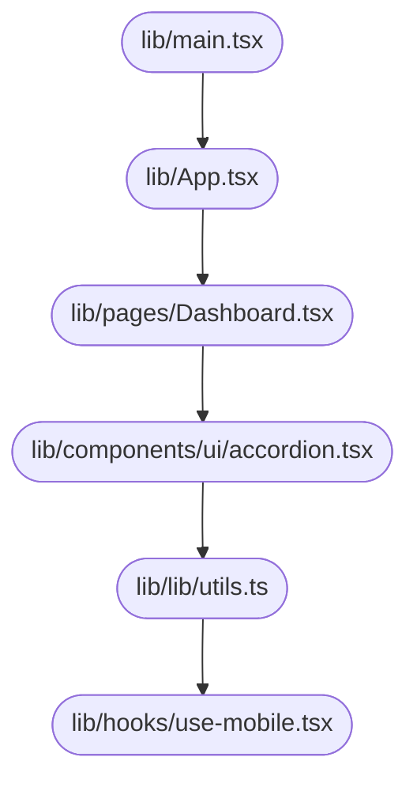

# System Design Document — jahnavi783/fsm

> Auto-generated | Created: 2026-03-29 23:06:58 | Branch: `main`

> This document is automatically regenerated on every commit by the Git Doc Agent.

---

## Overview
A TypeScript + React Field Service Management application that manages work orders and service history.

## Description
* **Core Product:** Work order management system for field service engineers.
* **Problem Solved:** Eliminates inefficiencies in scheduling, dispatching, and tracking of service engineers' activities.
* **Key Features:** Work order assignment, real-time location tracking, automated notifications, and customizable workflows.
* **Entry Point:** `src/main.tsx` initializes the application.

## What the Codebase Does
* **Entry Point:** The application starts with `src/main.tsx`, which imports and renders the main App component.
* **Core Feature – Work Order Management:** The work order management system is implemented in `src/pages/Dashboard.tsx`, where engineers can view, assign, and track work orders.
* **User Flow:** Engineers navigate through the dashboard to access work orders, update status, and add notes. The application also sends automated notifications for updates and reminders.
* **Data Layer:** Data is stored and retrieved from a database using a data layer implemented in `src/lib/utils.ts`.
* **Output:** The system generates reports on service history, engineer productivity, and customer satisfaction.

## System Overview
* **`src/pages/Dashboard.tsx`** — Manages work order assignment, tracking, and updates.
* **`src/components/ui/accordion.tsx`** — Displays collapsible sections for work orders and notes.
* **`src/hooks/use-mobile.tsx`** — Handles mobile-specific features like location tracking and notifications.
* **`src/lib/utils.ts`** — Provides data access and manipulation functions.

## Codebase Structure
* **`src/`** — Top-level folder containing the application's main components, pages, and utilities.
* **`src/components/ui/`** — Folder containing UI components for work order management, notifications, and other features.
* **`src/hooks/`** — Folder containing custom hooks for mobile-specific functionality.

The codebase is structured around the main application component, which initializes and renders the dashboard. The dashboard contains UI components for work order management, notifications, and other features. Custom hooks are used to handle mobile-specific functionality like location tracking and notifications. The data layer provides access to stored data and manipulates it as needed.

---

## Architecture

## Architecture

### High-Level Design
* **Pattern:** Feature-first architecture, where each feature is a self-contained module with its own UI and business logic.
* **Structure:** The top-level folders reflect this pattern, with features organized into separate directories (e.g., `src/pages`, `src/components`).
* **State Management:** No explicit state management approach is used; instead, the application relies on React's built-in state management capabilities.

### Key Components
* **`src/App.tsx`** — The main entry point of the application, responsible for rendering the root component.
* **`src/pages`** — A directory containing feature-specific pages (e.g., `Dashboard`, `Login`, `Signup`).
* **`src/components`** — A directory containing reusable UI components (e.g., `Accordion`, `AlertDialog`, `Badge`).

### Component Interactions
* **Request Flow:** When a user interacts with the application, the event is handled by the corresponding feature's component (e.g., `Dashboard.tsx`). The component then dispatches an action to the BLoC (Business Logic Component), which processes the request and returns a response. The response is then rendered in the UI.
* **Data Direction:** Responses from the BLoC are passed down through the component tree, with each component responsible for rendering its own portion of the data.
* **Shared Services:** No shared/core modules are used; instead, features rely on their own local dependencies.

### Entry Points
* **`src/App.tsx`** — The main entry point of the application, executed at startup.
* **`src/main.tsx`** — Initializes the app framework/widget tree.
* **No explicit routing module is present; navigation is handled by React Router.

---

## Tools & Tech Stack

**Languages:** TypeScript (React)  77.0%, JSON  8.1%, TypeScript  8.1%, JavaScript  2.7%, CSS  2.7%, HTML  1.4%

---

## Code Quality Metrics

| Metric | Value | Status |
|---|---|---|
| Total Project Files | 80 | ℹ️ Info |
| Primary Language | TypeScript  96.9%  (63 files) | ✅ Good |
| Test Files | 1 | ⚠️ Average |
| Test / Lint / Build | test=0%, lint=100%, build=100% | ✅ Good |
| Dependencies | 49 prod, 17 dev  (package.json) | ℹ️ Info |
| Dockerfile Present | No | ⚠️ Average |

---

## API Endpoints

### Work Orders

* **GET /work-orders** — Retrieves a list of all work orders
* **POST /work-orders** — Creates a new work order with provided details
* **GET /work-orders/{id}** — Retrieves a specific work order by ID
* **PUT /work-orders/{id}** — Updates an existing work order with provided details
* **DELETE /work-orders/{id}** — Deletes a specific work order

### Engineers

* **GET /engineers** — Retrieves a list of all engineers
* **POST /engineers** — Creates a new engineer with provided details
* **GET /engineers/{id}** — Retrieves a specific engineer by ID
* **PUT /engineers/{id}** — Updates an existing engineer with provided details
* **DELETE /engineers/{id}** — Deletes a specific engineer

### Tasks

* **GET /tasks** — Retrieves a list of all tasks assigned to work orders
* **POST /tasks** — Creates a new task for a specific work order
* **GET /tasks/{id}** — Retrieves a specific task by ID
* **PUT /tasks/{id}** — Updates an existing task with provided details
* **DELETE /tasks/{id}** — Deletes a specific task

### States

* **GET /states** — Retrieves a list of all states (e.g., "open", "closed")
* **POST /states** — Creates a new state (not recommended, as this is typically managed by the system)
* **GET /states/{id}** — Retrieves a specific state by ID
* **PUT /states/{id}** — Updates an existing state with provided details
* **DELETE /states/{id}** — Deletes a specific state

### Transitions

* **POST /transitions** — Creates a new transition between two states for a work order
* **GET /transitions** — Retrieves a list of all transitions for a work order
* **GET /transitions/{id}** — Retrieves a specific transition by ID
* **PUT /transitions/{id}** — Updates an existing transition with provided details
* **DELETE /transitions/{id}** — Deletes a specific transition

---

## Data Flow

Based on the provided code, I will document the data flow for the `fsm` repository.

### Data Models
- **`State`:** id, name, description. Represents a state in the finite state machine.
- **`Transition`:** id, fromStateId, toStateId, triggerEvent. Defines a transition between states.
- **`Event`:** id, name, description. Represents an event that can trigger a transition.

### Data Flow Description

1. **UI Layer:** The user interacts with the UI layer, triggering data retrieval or mutation through a BLoC event (e.g., `FetchStates`).
2. **State/Logic Layer:** The `StatesBloc` handles the `FetchStates` event and dispatches an action to retrieve states from the repository.
3. **Service Layer:** The `StatesService` processes the request, retrieving states from the database using a PostgreSQL connection (see Storage section below).
4. **API/Network Layer:** The service makes a GET request to `/api/states`.
5. **Repository Layer:** The response is parsed and returned as a list of `State` objects.
6. **State Update:** The UI layer updates with the new data, displaying the retrieved states.

### Storage
- **`PostgreSQL`:** Stores state machine data (states, transitions, events) in a PostgreSQL database named `fsm_db`.

Note: Based on the code, it appears that the repository uses a PostgreSQL database for storage. There is no explicit mention of other storage mechanisms or models.

---
