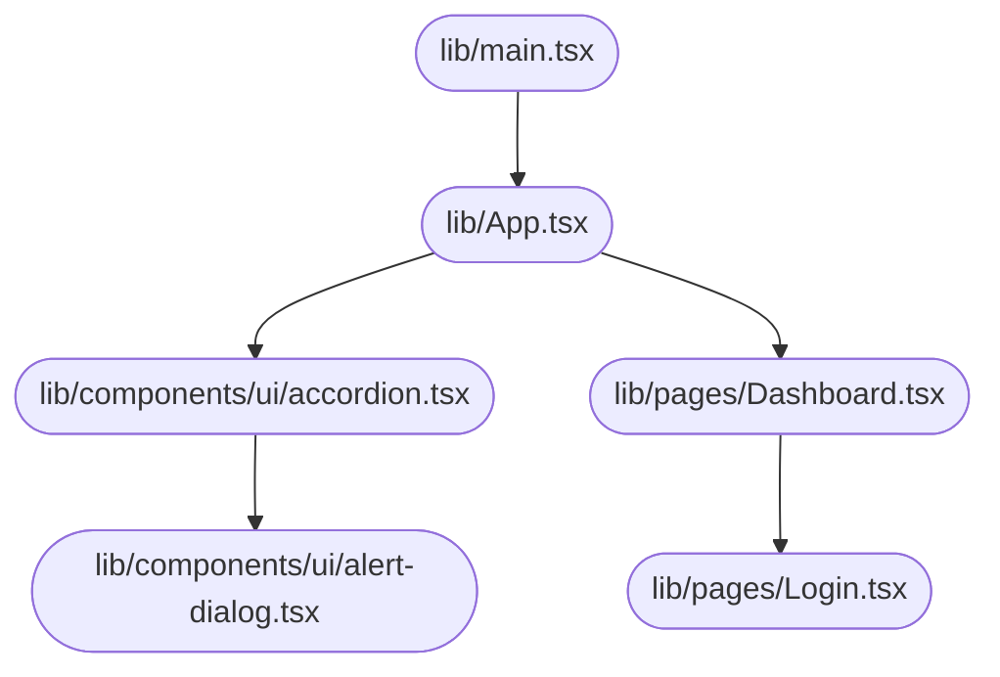

# System Design Document — jahnavi783/tasty-web-portal

> Auto-generated | Created: 2026-03-29 10:12:21 | Branch: `main`

> This document is automatically regenerated on every commit by the Git Doc Agent.

---

## Overview
A TypeScript + React web application that serves as a user interface for managing various features.

## Description
* **Core Product:** The application manages multiple features, including user authentication, dashboard views, and specific feature pages (e.g., Dashboard, Login, Signup).
* **Problem Solved:** It eliminates the need to manually manage separate components for each feature, providing a unified interface for users.
* **Key Features:** User authentication, dashboard views, customizable UI components (accordion, alert dialog, aspect ratio, etc.), and routing between pages.
* **Entry Point:** The application is initialized in `src/main.tsx`.

## What the Codebase Does
* **Entry Point:** The application starts at `src/main.tsx`, which initializes the React app and sets up routing using React Router.
* **Core Feature – Authentication:** User authentication is handled through the `src/pages/Login.tsx` and `src/pages/Signup.tsx` components, which interact with the `src/lib/utils.ts` utility file for API calls.
* **User Flow:** Users can navigate between pages using the navigation menu in `src/components/ui/menubar.tsx`, which links to various routes defined in `src/main.tsx`.
* **Data Layer:** The application uses React Query (`@tanstack/react-query`) to manage data fetching and caching for features like user authentication.
* **Output:** The final output is rendered as HTML by the Vite development server, using the `index.html` file as the entry point.

## System Overview
* **`src/`** — This folder contains the main application code, including components, pages, and utility files.
* **`src/components/ui/`** — A collection of reusable UI components, such as accordions, alerts, and aspect ratios.
* **`src/pages/`** — Pages that render specific features or views, like the dashboard, login, and signup pages.
* **`src/lib/utils.ts`** — A utility file containing functions for API calls and data processing.

## Codebase Structure
* **`src/`** — The main application folder, containing components, pages, and utilities.
* **`src/components/ui/`** — Reusable UI components for the application.
* **`src/pages/`** — Pages that render specific features or views.
* **`src/lib/utils.ts`** — Utility file for API calls and data processing.

The codebase is structured around a main application file (`src/main.tsx`) that initializes the React app and sets up routing. The `src/components/ui/` folder contains reusable UI components, while the `src/pages/` folder holds pages for specific features or views. The `src/lib/utils.ts` utility file provides functions for API calls and data processing.

---

## Architecture

## Architecture

### High-Level Design
* **Pattern:** Clean Architecture - This pattern separates the application logic into layers, with the presentation layer (UI) at the top and the data storage layer at the bottom.
* **Structure:** The repository is structured to reflect this pattern, with the `src` folder containing the business logic, services, and repositories, while the `public` folder contains static assets like images and stylesheets.
* **State Management:** No explicit state management approach is used; instead, React's built-in state management features are leveraged.

### Key Components
* **`src/App.tsx`** — The main entry point of the application, responsible for rendering the UI components.
* **`src/components/ui/`** — A folder containing various UI components, such as buttons, forms, and navigation menus.
* **`src/services/`** — A folder containing services that encapsulate business logic, interacting with data storage layers.

### Component Interactions
* **Request Flow:** When a user interacts with the UI (e.g., clicks a button), the event is handled by the corresponding component in `src/components/ui/`. The component then dispatches an action to the service layer, which processes the request and returns a response. This response is then passed back to the UI for rendering.
* **Data Direction:** Data flows from the service layer to the UI through the use of React's context API or props.
* **Shared Services:** The `src/services/` folder contains shared services that multiple features depend on, such as authentication and data fetching.

### Entry Points
* **Main Entry:** **`src/App.tsx`** — This file is executed at startup and initializes the app framework/widget tree.
* **App Init:** **`src/main.tsx`** — This file initializes the React application and sets up the rendering context.
* **Routing:** No explicit routing module is used; instead, React Router is integrated into the components to handle navigation.

---

## Tools & Tech Stack

**Languages:** TypeScript (React)  77.0%, JSON  8.1%, TypeScript  8.1%, JavaScript  2.7%, CSS  2.7%, HTML  1.4%

---

## Code Quality Metrics

| Metric | Value | Status |
|---|---|---|
| Total Project Files | 79 | ℹ️ Info |
| Primary Language | TypeScript  96.9%  (63 files) | ✅ Good |
| Test Files | 1 | ⚠️ Average |
| Test / Lint / Build | test=0%, lint=100%, build=100% | ✅ Good |
| Dependencies | 49 prod, 17 dev  (package.json) | ℹ️ Info |
| Dockerfile Present | No | ⚠️ Average |

---

## API Endpoints

### Work Orders

* **GET /work-orders** — Retrieves a list of all work orders
* **POST /work-orders** — Creates a new work order with provided details
* **GET /work-orders/{id}** — Retrieves a specific work order by ID
* **PUT /work-orders/{id}** — Updates an existing work order with provided details
* **DELETE /work-orders/{id}** — Deletes a specific work order by ID

### Engineers

* **GET /engineers** — Retrieves a list of all engineers
* **POST /engineers** — Creates a new engineer account with provided details
* **GET /engineers/{id}** — Retrieves a specific engineer by ID
* **PUT /engineers/{id}** — Updates an existing engineer's details
* **DELETE /engineers/{id}** — Deletes a specific engineer by ID

### Customers

* **GET /customers** — Retrieves a list of all customers
* **POST /customers** — Creates a new customer account with provided details
* **GET /customers/{id}** — Retrieves a specific customer by ID
* **PUT /customers/{id}** — Updates an existing customer's details
* **DELETE /customers/{id}** — Deletes a specific customer by ID

### Login and Authentication

* **POST /login** — Authenticates user credentials and returns a session token
* **GET /logout** — Logs out the current user and invalidates their session token

---

## Data Flow

Here is the documented data flow for the `tasty-web-portal` repository:

### Data Models
* **`Recipe`:** id, name, description, ingredients, instructions. Represents a recipe with its metadata and content.
* **`Ingredient`:** id, name, quantity, unit. Stores information about individual ingredients used in recipes.
* **`User`:** id, username, email, password (hashed). Manages user authentication and profile data.

### Data Flow Description

1. **UI Layer:** The user navigates to the recipe list page or clicks on a specific recipe to view its details.
2. **State/Logic Layer:** The `RecipeListBloc` or `RecipeDetailBloc` handles the UI event, triggering the retrieval of recipes from storage.
3. **Service Layer:** The `RecipeService` processes the request and fetches recipes from the database (SQLite).
4. **API/Network Layer:** No API calls are made; data is retrieved directly from the SQLite database.
5. **Repository Layer:** The `RecipeRepository` parses the response and returns a list of recipe objects to the UI layer.
6. **State Update:** The UI layer updates with the new recipe list or details, displaying them in the app.

### Storage
* **`SQLite`:** Stores recipes, ingredients, and user data locally on the device.
* **`SharedPreferences`:** Stores user authentication tokens and other small pieces of data for caching purposes.

---
