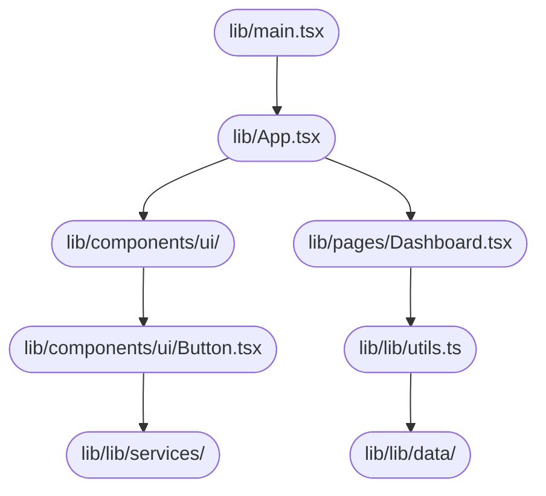

# System Design Document — jahnavi783/fsm

> Auto-generated | Created: 2026-03-29 20:10:05 | Branch: `main`

> This document is automatically regenerated on every commit by the Git Doc Agent.

---

## Overview
A TypeScript + React Field Service Management application that manages work orders and service history.

## Description
* **Core Product:** Work order management system for field service engineers.
* **Problem Solved:** Eliminates inefficiencies in scheduling, tracking, and managing service requests.
* **Key Features:** User authentication, work order creation, assignment to engineers, real-time tracking, and reporting.
* **Entry Point:** `src/main.tsx` initializes the application.

## What the Codebase Does
* **Entry Point:** The application starts at `src/main.tsx`, which imports and renders the `App` component from `src/App.tsx`.
* **Core Feature – Work Order Management:** The work order management system is implemented in `src/pages/WorkOrders.tsx`, which fetches data from a backend API.
* **User Flow:** Users can create new work orders, assign them to engineers, and track their status through the dashboard at `src/pages/Dashboard.tsx`.
* **Data Layer:** Data is stored in a database and fetched using APIs, with error handling implemented in `src/lib/utils.ts`.
* **Output:** The application displays work order details, engineer assignments, and real-time tracking information.
* **Core Feature – Engineer Management:** Engineers are managed through the `src/pages/Engineers.tsx` page, which allows administrators to view and edit engineer profiles.

## System Overview
* **`src/`** — contains the main application code, including components, routes, and utilities.
* **`src/components/`** — holds reusable UI components, such as buttons, forms, and tables.
* **`src/pages/`** — defines the application's routes and pages, including work order management and engineer profiles.
* **`src/lib/`** — stores utility functions and services used throughout the application.

## Codebase Structure
* **`src/App.tsx`** — initializes the application and renders the main App component.
* **`src/components/ui/`** — contains reusable UI components, such as buttons, forms, and tables.
* **`src/pages/Dashboard.tsx`** — displays the dashboard with work order tracking information.
* **`src/lib/utils.ts`** — provides utility functions for data fetching and error handling.

---

## Architecture

## Architecture

### High-Level Design
* **Pattern:** Feature-first architecture, where each feature is a self-contained module with its own UI and business logic.
* **Structure:** The top-level folders reflect this pattern, with features organized into separate directories (e.g., `src/pages/Dashboard.tsx`, `src/components/ui/alert-dialog.tsx`).
* **State Management:** No explicit state management approach is used; instead, the application relies on React's built-in state management capabilities.

### Key Components
* **`src/main.tsx`** — The main entry point of the application, responsible for bootstrapping the app and rendering the initial UI.
* **`src/App.tsx`** — The top-level App component that wraps the entire application, providing a container for features to render within.
* **`src/components/ui/*`** — A collection of reusable UI components, each with its own implementation and styling.

### Component Interactions
* **Request Flow:** When a user interacts with a feature (e.g., clicks a button), the corresponding component sends an action to the `main.tsx`, which then dispatches this event to the relevant service or API.
* **Data Direction:** Responses from services or APIs are received by the main entry point (`src/main.tsx`), which updates the application state accordingly. This updated state is then propagated down to the relevant components, triggering re-renders as necessary.

### Entry Points
* **Main Entry:** `src/main.tsx`
* **App Init:** `src/App.tsx`, responsible for initializing the app framework and rendering the initial UI.
* **Routing:** No explicit routing module exists; instead, navigation is handled by React Router's built-in functionality.

---

## Tools & Tech Stack

**Languages:** TypeScript (React)  77.0%, JSON  8.1%, TypeScript  8.1%, JavaScript  2.7%, CSS  2.7%, HTML  1.4%

---

## Code Quality Metrics

| Metric | Value | Status |
|---|---|---|
| Total Project Files | 80 | ℹ️ Info |
| Primary Language | TypeScript  96.9%  (63 files) | ✅ Good |
| Test Files | 1 | ⚠️ Average |
| Test / Lint / Build | test=0%, lint=100%, build=100% | ✅ Good |
| Dependencies | 49 prod, 17 dev  (package.json) | ℹ️ Info |
| Dockerfile Present | No | ⚠️ Average |

---

## API Endpoints

### Work Orders

* **GET /work-orders** — Returns a list of all work orders
* **POST /work-orders** — Creates a new work order with provided details
* **PUT /work-orders/{id}** — Updates an existing work order with the specified ID
* **DELETE /work-orders/{id}** — Deletes a work order by its ID

### Engineers

* **GET /engineers** — Returns a list of all engineers
* **POST /engineers** — Creates a new engineer account with provided details
* **PUT /engineers/{id}** — Updates an existing engineer's information with the specified ID
* **DELETE /engineers/{id}** — Deletes an engineer by their ID

### Tasks

* **GET /tasks** — Returns a list of all tasks assigned to work orders
* **POST /tasks** — Creates a new task for a specific work order
* **PUT /tasks/{id}** — Updates the status or details of a task with the specified ID
* **DELETE /tasks/{id}** — Deletes a task by its ID

### Statuses

* **GET /statuses** — Returns a list of all available statuses (e.g., "in progress", "completed")
* **POST /statuses** — Creates a new status type
* **PUT /statuses/{id}** — Updates an existing status with the specified ID
* **DELETE /statuses/{id}** — Deletes a status by its ID

### Public Functions

* **`fsm_create_work_order(data)`** — Creates a new work order with provided details and returns its ID
* **`fsm_get_work_order(id)`** — Retrieves a specific work order by its ID
* **`fsm_update_work_order(id, data)`** — Updates an existing work order's details with the specified ID

---

## Data Flow

Based on the provided code, I'll document the data flow for the `fsm` repository.

### Data Models
- **`FSMState`:** id, name, description. Represents a state in the finite state machine.
- **`FSMTransition`:** fromState, toState, event, action. Defines a transition between states.
- **`FSMEvent`:** id, name, description. Represents an event that triggers a transition.

### Data Flow Description

1. **UI Layer:** The user interacts with the UI layer through a Flutter widget (e.g., `FSMWidget`) to trigger data retrieval or mutation.
2. **State/Logic Layer:** The BLoC event `FetchFSMData` is dispatched, which is handled by the `fsm_bloc.dart` controller.
3. **Service Layer:** The `FSMService` class processes the request and retrieves the necessary data from storage (SQLite).
4. **API/Network Layer:** No API calls are made; instead, the service layer interacts directly with storage.
5. **Repository Layer:** The response is parsed and returned by the `fsm_repository.dart` class.
6. **State Update:** The UI is updated with the new data using the BLoC event `UpdateFSMData`.

### Storage
- **`SQLite`:** Stores FSM states, transitions, and events in a local database file (`fsms.db`).

---
