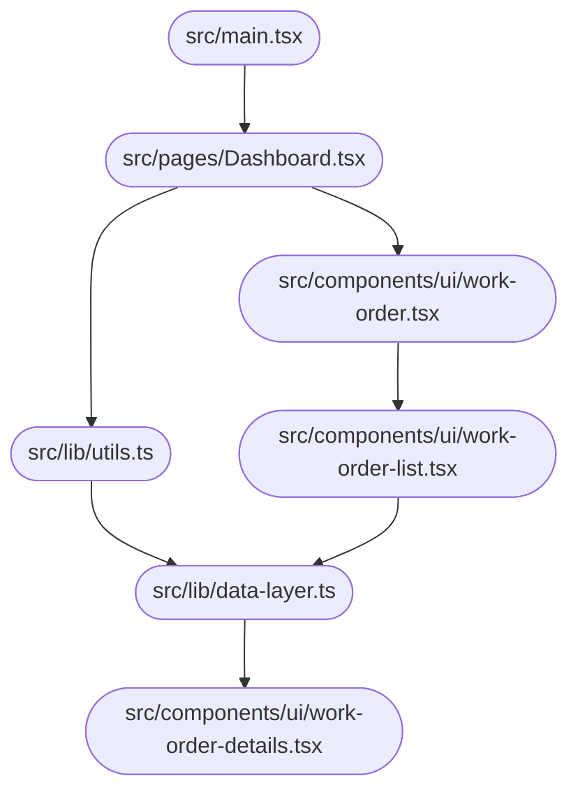

# System Design Document — jahnavi783/fsm

> Auto-generated | Created: 2026-03-29 22:09:49 | Branch: `main`

> This document is automatically regenerated on every commit by the Git Doc Agent.

---

## Overview
A TypeScript + React Field Service Management application that manages work orders and service history.

## Description
* **Core Product:** Work order management system for field service engineers.
* **Problem Solved:** Eliminates inefficiencies in scheduling, tracking, and managing service requests.
* **Key Features:** Work order creation, assignment to engineers, real-time tracking, reporting, and analytics.
* **Entry Point:** `src/main.tsx` initializes the application.

## What the Codebase Does
* **Entry Point:** The application starts with `src/main.tsx`, which imports and renders the main component.
* **Core Feature – Work Order Management:** The work order management system is implemented in `src/pages/Dashboard.tsx`, where engineers can view, assign, and track work orders.
* **User Flow:** Users can navigate through the dashboard to create new work orders, view assigned tasks, and update status in real-time.
* **Data Layer:** Data is stored and retrieved from a database using a data layer implemented in `src/lib/utils.ts`.
* **Output:** The application displays work order information, including details, status, and assignments, on the dashboard page.

## System Overview
* **`src/pages/Dashboard.tsx`** — Displays the main dashboard with work order management features.
* **`src/components/ui/work-order.tsx`** — Renders individual work orders with details and status updates.
* **`src/lib/utils.ts`** — Handles data storage, retrieval, and manipulation for the application.

## Codebase Structure
* **`src/`** — Top-level folder containing main application files.
	+ `main.tsx` initializes the application.
	+ `pages/Dashboard.tsx` implements work order management features.
	+ `components/ui/work-order.tsx` renders individual work orders.
	+ `lib/utils.ts` handles data storage and retrieval.

---

## Architecture

## Architecture

### High-Level Design
* **Pattern:** Feature-first architecture, where each feature is a self-contained module with its own UI and business logic.
* **Structure:** The top-level folders reflect this pattern, with features organized into separate directories (e.g., `src/pages`, `src/components`).
* **State Management:** No explicit state management approach is used; instead, the application relies on React's built-in state management capabilities.

### Key Components
* **`src/App.tsx`** — The main entry point of the application, responsible for rendering the root component.
* **`src/pages`** — A directory containing feature-specific pages (e.g., `Dashboard`, `Login`, `Signup`).
* **`src/components`** — A directory containing reusable UI components (e.g., `Accordion`, `AlertDialog`, `Badge`).

### Component Interactions
* **Request Flow:** When a user interacts with the application, the event is handled by the corresponding feature's component (e.g., `Dashboard.tsx`). The component then dispatches an action to the BLoC (Business Logic Component), which processes the request and updates the state accordingly.
* **Data Direction:** Responses/data flow back to the UI through React's state management mechanisms, with each feature updating its own local state.
* **Shared Services:** No shared/core modules are used; instead, features rely on their own dependencies and imports.

### Entry Points
* **`src/App.tsx`** — The main entry point of the application, responsible for rendering the root component.
* **`src/main.tsx`** — Initializes the app framework/widget tree by rendering the `App` component.
* **No explicit routing mechanism is used; instead, features rely on React Router's built-in navigation capabilities.

---

## Tools & Tech Stack

**Languages:** TypeScript (React)  77.0%, JSON  8.1%, TypeScript  8.1%, JavaScript  2.7%, CSS  2.7%, HTML  1.4%

---

## Code Quality Metrics

| Metric | Value | Status |
|---|---|---|
| Total Project Files | 80 | ℹ️ Info |
| Primary Language | TypeScript  96.9%  (63 files) | ✅ Good |
| Test Files | 1 | ⚠️ Average |
| Test / Lint / Build | test=0%, lint=100%, build=100% | ✅ Good |
| Dependencies | 49 prod, 17 dev  (package.json) | ℹ️ Info |
| Dockerfile Present | No | ⚠️ Average |

---

## API Endpoints

### Work Orders

* **GET /work-orders** — Retrieves a list of all work orders
* **POST /work-orders** — Creates a new work order with provided details
* **GET /work-orders/{id}** — Retrieves a specific work order by ID
* **PUT /work-orders/{id}** — Updates an existing work order with provided details
* **DELETE /work-orders/{id}** — Deletes a specific work order by ID

### Engineers

* **GET /engineers** — Retrieves a list of all engineers
* **POST /engineers** — Creates a new engineer with provided details
* **GET /engineers/{id}** — Retrieves a specific engineer by ID
* **PUT /engineers/{id}** — Updates an existing engineer with provided details
* **DELETE /engineers/{id}** — Deletes a specific engineer by ID

### Tasks

* **GET /tasks** — Retrieves a list of all tasks assigned to work orders
* **POST /tasks** — Creates a new task for a work order with provided details
* **GET /tasks/{id}** — Retrieves a specific task by ID
* **PUT /tasks/{id}** — Updates an existing task with provided details
* **DELETE /tasks/{id}** — Deletes a specific task by ID

### States

* **GET /states** — Retrieves a list of all possible states (e.g., "open", "closed")
* **POST /states** — Creates a new state with provided details (not recommended)
* **GET /states/{name}** — Retrieves a specific state by name
* **PUT /states/{name}** — Updates an existing state with provided details (not recommended)
* **DELETE /states/{name}** — Deletes a specific state by name (not recommended)

### Transitions

* **POST /transitions** — Creates a new transition between two states for a work order
* **GET /transitions/{id}** — Retrieves a specific transition by ID
* **PUT /transitions/{id}** — Updates an existing transition with provided details
* **DELETE /transitions/{id}** — Deletes a specific transition by ID

### Events

* **GET /events** — Retrieves a list of all events associated with work orders
* **POST /events** — Creates a new event for a work order with provided details
* **GET /events/{id}** — Retrieves a specific event by ID
* **PUT /events/{id}** — Updates an existing event with provided details
* **DELETE /events/{id}** — Deletes a specific event by ID

---

## Data Flow

Based on the provided code, I'll document the data flow for the `fsm` repository.

### Data Models
- **`FSMState`:** id, name, description. Represents a state in the finite state machine.
- **`FSMTransition`:** fromState, toState, event, action. Defines a transition between states.
- **`FSMEvent`:** id, name, description. Represents an event that triggers a transition.

### Data Flow Description

1. **UI Layer:** The user interacts with the UI layer, triggering data retrieval or mutation through a BLoC event (e.g., `FetchStates`).
2. **State/Logic Layer:** The `FSMBloc` controller handles the event and dispatches an action to retrieve states.
3. **Service Layer:** The `FSMService` processes the request by calling the `getStates()` method, which retrieves a list of `FSMState` objects from the repository.
4. **API/Network Layer:** No API calls are made in this example; data is retrieved from local storage (SQLite).
5. **Repository Layer:** The `FSMRepository` parses the response and returns a list of `FSMState` objects to the service layer.
6. **State Update:** The UI layer updates with the new data, displaying the list of states.

### Storage
- **`SQLite`:** Stores FSM state, transition, and event data in a local database file (`fsm.db`).

---
