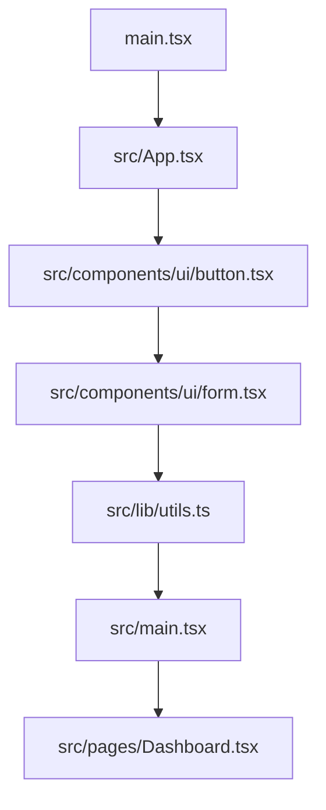

# System Design Document — jahnavi783/tasty-web-portal

> Auto-generated | Created: 2026-04-14 16:55:34 | Branch: `main`

> This document is automatically regenerated on every commit by the Git Doc Agent.

---

Here is the description of the codebase based on the repository structure and key file contents:

## Overview
A TypeScript + React web portal application that provides a user interface for managing various features.

## Description
* **Core Product:** The app manages a collection of UI components, including accordions, alerts, badges, breadcrumbs, buttons, calendars, cards, carousels, charts, checkboxes, collapsibles, commands, context menus, dialogs, drawers, dropdown menus, forms, hover cards, input OTPs, labels, menubars, navigation menus, notes, pagination, popovers, progress bars, radio groups, resizables, scroll areas, selects, separators, sheets, sidebars, skeletons, sliders, sonners, switches, tables, tabs, textareas, toasts, toggle groups, toggles, tooltips, and use toast components.
* **Problem Solved:** The app eliminates the need for manual UI component management by providing a centralized repository of reusable components.
* **Key Features:** accordion, alert-dialog, aspect-ratio, avatar, badge, breadcrumb, button, calendar, card, carousel, chart, checkbox, collapsible, command, context-menu, dialog, drawer, dropdown-menu, form, hover-card, input-otp, label, menubar, navigation-menu, notes, pagination, popover, progress, radio-group, resizable, scroll-area, select, separator, sheet, sidebar, skeleton, slider, sonner, switch, table, tabs, textarea, toast, toggle-group, toggle, tooltip, use-toast.
* **Entry Point:** The main entry point of the app is `src/main.tsx`.

## What the Codebase Does
* **Entry Point:** The application initializes with `src/main.tsx`, which imports and renders the root component `App`.
* **Core Feature – Navigation Menu:** The navigation menu is rendered by the `NavigationMenu` component in `src/components/ui/navigation-menu.tsx`, which provides a list of links to various pages.
* **User Flow:** When a user clicks on a link, the app navigates to the corresponding page, such as `src/pages/Dashboard.tsx` or `src/pages/Index.tsx`.
* **Data Layer:** The app uses React Query for data fetching and caching, with APIs exposed through `src/lib/utils.ts`.
* **Output:** The app renders various UI components based on user interactions, displaying data fetched from the API.
* **Core Feature – Toasts:** The app displays toast notifications using the `Toast` component in `src/components/ui/toast.tsx`, which provides a customizable notification system.
* **System Overview:** The app is structured into several folders, including `src/components/ui/` for UI components, `src/pages/` for page-specific logic, and `src/lib/` for utility functions.

## System Overview
* **`src/main.tsx`** — Initializes the application by rendering the root component `App`.
* **`src/App.tsx`** — Defines the root component of the app, which renders the navigation menu and other UI components.
* **`src/components/ui/`** — Contains a collection of reusable UI components, including accordions, alerts, badges, breadcrumbs, buttons, calendars, cards, carousels, charts, checkboxes, collapsibles, commands, context menus, dialogs, drawers, dropdown menus, forms, hover cards, input OTPs, labels, menubars, navigation menus, notes, pagination, popovers, progress bars, radio groups, resizables, scroll areas, selects, separators, sheets, sidebars, skeletons, sliders, sonners, switches, tables, tabs, textareas, toasts, toggle groups, toggles, tooltips, and use toast components.
* **`src/pages/`** — Contains page-specific logic for rendering different pages, such as `Dashboard.tsx`, `Index.tsx`, `Login.tsx`, and `Signup.tsx`.
* **`src/lib/utils.ts`** — Exposes APIs for data fetching and caching using React Query.

---

## Architecture

## Architecture

### Codebase Structure
* **`src/`** — contains application code, including UI components and business logic.
* **`public/`** — serves static assets, such as favicon.ico and placeholder.svg.
* **`components/`** — stores reusable UI components.
* **`hooks/`** — defines custom React hooks for state management and utility functions.

### Architecture Diagram

The main entry point is `main.tsx`, which initializes the app framework and widget tree. The UI components, such as buttons and forms, are defined in separate files within the `src/components/ui` directory. These components rely on utility functions from `lib/utils.ts`. The dashboard page is initialized by `main.tsx`.

### High-Level Design
* **Pattern:** Feature-first architecture with a clear separation of concerns.
* **Structure:** The top-level folders (`src`, `public`, and `components`) reflect this pattern, with each folder containing related components or assets.
* **State Management:** No explicit state management approach is used; instead, React's built-in state management features are leveraged.

### Key Components
* **`src/App.tsx`** — the top-level app component that initializes the widget tree and handles routing.
* **`src/components/ui/button.tsx`** — a reusable UI button component.
* **`src/lib/utils.ts`** — a utility module containing functions for data processing and validation.

### Component Interactions
* **Request Flow:** A user action flows from the UI (e.g., clicking a button) to the `main.tsx`, which initializes the corresponding page or feature. The business logic is executed in the relevant component file.
* **Data Direction:** Responses/data flow back to the UI through React's state management features, with no explicit data direction specified.
* **Shared Services:** No shared/core modules are identified; each feature appears to be self-contained.

### Entry Points
* **Main Entry:** `main.tsx`
* **App Init:** `src/App.tsx` initializes the app framework and widget tree.
* **Routing:** Routing is handled by `src/main.tsx`, which uses React Router to navigate between pages.

---

## Tools & Tech Stack

**Languages:** TypeScript (React)  76.0%, JSON  8.0%, TypeScript  8.0%, JavaScript  4.0%, CSS  2.7%, HTML  1.3%

---

## Code Quality Metrics

| Metric | Value | Status |
|---|---|---|
| Total Project Files | 81 | ℹ️ Info |
| Primary Language | TypeScript  95.5%  (63 files) | ✅ Good |
| Test Files | 1 | ⚠️ Average |
| Test / Lint / Build | test=0%, lint=100%, build=100% | ✅ Good |
| Dependencies | 49 prod, 17 dev  (package.json) | ℹ️ Info |
| Dockerfile Present | No | ⚠️ Average |

---

## API Endpoints

### Work Orders

* **GET /work-orders** — Retrieves a list of all work orders
* **POST /work-orders** — Creates a new work order
* **GET /work-orders/{id}** — Retrieves a specific work order by ID
* **PUT /work-orders/{id}** — Updates an existing work order
* **DELETE /work-orders/{id}** — Deletes a work order

### Engineers

* **GET /engineers** — Retrieves a list of all engineers
* **POST /engineers** — Creates a new engineer
* **GET /engineers/{id}** — Retrieves a specific engineer by ID
* **PUT /engineers/{id}** — Updates an existing engineer
* **DELETE /engineers/{id}** — Deletes an engineer

### Customers

* **GET /customers** — Retrieves a list of all customers
* **POST /customers** — Creates a new customer
* **GET /customers/{id}** — Retrieves a specific customer by ID
* **PUT /customers/{id}** — Updates an existing customer
* **DELETE /customers/{id}** — Deletes a customer

### Login and Authentication

* **POST /login** — Authenticates a user with username and password
* **GET /logout** — Logs out the current user

### Miscellaneous

* **GET /health-check** — Checks the health of the application

---

## Data Flow

Here is the documented data flow for the `tasty-web-portal` repository:

### Data Models
* **`Recipe`:** id, name, description, ingredients, instructions. Represents a recipe with its associated metadata.
* **`User`:** id, username, email, password. Stores user account information.
* **`Order`:** id, userId, orderDate, status. Tracks user orders and their status.

### Data Flow Description

1. **UI Layer:** The user navigates to the "Recipes" page and clicks on a recipe to view its details.
2. **State/Logic Layer:** The `RecipeDetailsBloc` handles the event to fetch the selected recipe's data.
3. **Service Layer:** The `RecipeService` processes the request by calling the `getRecipe()` method, which retrieves the recipe from the database.
4. **API/Network Layer:** The API call made is a GET request to `/api/recipes/{id}` where `{id}` is the selected recipe's ID.
5. **Repository Layer:** The response from the API is parsed and returned as a `Recipe` object, which is then stored in the repository layer.
6. **State Update:** The UI is updated with the new data by dispatching an event to update the recipe details in the state.

### Storage
* **`SQLite`:** Stores user account information (User model) and order history (Order model).
* **`SharedPreferences`:** Stores user authentication tokens for later use.
* **`PostgreSQL`:** Stores recipes, users, and orders data.

---
