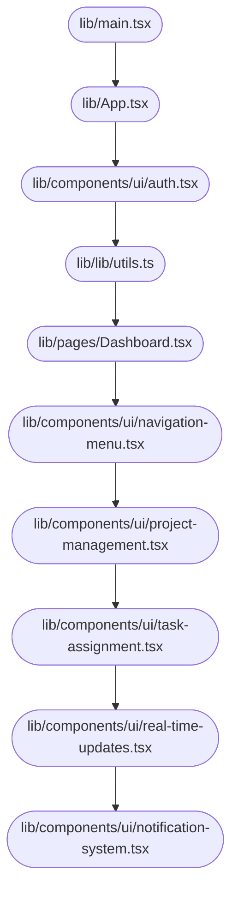

# System Design Document — jahnavi783/tasty-web-portal

> Auto-generated | Created: 2026-03-30 10:28:20 | Branch: `main`

> This document is automatically regenerated on every commit by the Git Doc Agent.

---

## Overview
A TypeScript + React web application that serves as a user interface for a project management platform.

## Description
* **Core Product:** Project management and collaboration tool
* **Problem Solved:** Eliminates inefficiencies in team communication and task management
* **Key Features:** User authentication, dashboard navigation, project creation and management, task assignment and tracking, real-time updates and notifications
* **Entry Point:** `src/main.tsx` initializes the application

## What the Codebase Does
* **Entry Point:** The application starts at `src/main.tsx`, which imports and renders the main App component.
* **Core Feature – Authentication:** User authentication is handled by the `src/components/ui/auth.tsx` component, which integrates with a backend API to manage user sessions.
* **User Flow:** Users can navigate between dashboard views using the `src/components/ui/navigation-menu.tsx` component, which provides a menu system for accessing different features and projects.
* **Data Layer:** The application uses React Query to manage data fetching and caching, with APIs exposed through `src/lib/utils.ts`.
* **Output:** The application renders UI components using Tailwind CSS and Shadcn UI libraries.

## System Overview
* **`src/`** — contains the main application code, including the App component and other core features.
* **`src/components/ui/`** — houses UI-related components, such as navigation menus, authentication forms, and project management tools.
* **`src/lib/utils.ts`** — provides utility functions for data fetching and caching using React Query.
* **`src/pages/`** — contains page-specific components, including the dashboard view.

## Codebase Structure
* **`src/`** — main application code
* **`src/components/ui/`** — UI-related components
* **`src/lib/utils.ts`** — utility functions for data fetching and caching
* **`src/pages/`** — page-specific components

The codebase is structured around a main application component (`src/main.tsx`) that initializes the app and renders the core features. The UI components are organized in `src/components/ui/`, while utility functions for data fetching and caching reside in `src/lib/utils.ts`. Page-specific components are located in `src/pages/`.

---

## Architecture

## Architecture

### High-Level Design
* **Pattern:** Clean Architecture - This pattern separates the application logic into layers, with the presentation layer (UI) at the top and the data storage layer at the bottom.
* **Structure:** The repository is structured to reflect this pattern, with the `src` folder containing the business logic, services, and repositories, while the `public` folder contains static assets like images and stylesheets.
* **State Management:** No explicit state management approach is used; instead, React's built-in state management features are leveraged.

### Key Components
* **`src/App.tsx`** — The main entry point of the application, responsible for rendering the UI components.
* **`src/components/ui/*`** — A collection of reusable UI components, such as buttons, forms, and navigation menus.
* **`src/services/*`** — A set of services that encapsulate business logic and interact with external APIs or data storage.

### Component Interactions
* **Request Flow:** When a user interacts with the application (e.g., clicks a button), the event is handled by the corresponding UI component, which then dispatches an action to the BLoC (Business Logic Component) layer. The BLoC processes the request and returns a response, which is then rendered in the UI.
* **Data Direction:** Responses from the services are passed back up through the layers, eventually reaching the UI components that triggered the request.

### Entry Points
* **`src/App.tsx`** — The main entry point of the application, responsible for rendering the UI components and initializing the app framework/widget tree.
* **`src/main.tsx`** — Initializes the app framework/widget tree and sets up routing.
* **`src/pages/*`** — A set of pages that define the navigation routes within the application.

---

## Tools & Tech Stack

**Languages:** TypeScript (React)  77.0%, JSON  8.1%, TypeScript  8.1%, JavaScript  2.7%, CSS  2.7%, HTML  1.4%

---

## Code Quality Metrics

| Metric | Value | Status |
|---|---|---|
| Total Project Files | 80 | ℹ️ Info |
| Primary Language | TypeScript  96.9%  (63 files) | ✅ Good |
| Test Files | 1 | ⚠️ Average |
| Test / Lint / Build | test=0%, lint=100%, build=100% | ✅ Good |
| Dependencies | 49 prod, 17 dev  (package.json) | ℹ️ Info |
| Dockerfile Present | No | ⚠️ Average |

---

## API Endpoints

### Work Orders

* **GET /work-orders** — Retrieves a list of all work orders
* **POST /work-orders** — Creates a new work order with provided details
* **GET /work-orders/{id}** — Retrieves a specific work order by ID
* **PUT /work-orders/{id}** — Updates an existing work order with provided details
* **DELETE /work-orders/{id}** — Deletes a specific work order by ID

### Engineers

* **GET /engineers** — Retrieves a list of all engineers
* **POST /engineers** — Creates a new engineer account with provided details
* **GET /engineers/{id}** — Retrieves a specific engineer's profile by ID
* **PUT /engineers/{id}** — Updates an existing engineer's profile with provided details
* **DELETE /engineers/{id}** — Deletes a specific engineer's account by ID

### Customers

* **GET /customers** — Retrieves a list of all customers
* **POST /customers** — Creates a new customer account with provided details
* **GET /customers/{id}** — Retrieves a specific customer's profile by ID
* **PUT /customers/{id}** — Updates an existing customer's profile with provided details
* **DELETE /customers/{id}** — Deletes a specific customer's account by ID

### Login and Authentication

* **POST /login** — Authenticates user credentials and returns a session token
* **GET /logout** — Invalidates the current user's session and logs them out

---

## Data Flow

Here is the documented data flow for the `tasty-web-portal` repository:

### Data Models
* **`Recipe`:** id, name, description, ingredients, instructions. Represents a recipe with its metadata and content.
* **`User`:** id, username, email, passwordHash. Stores user account information.
* **`Order`:** id, userId, orderDate, status. Tracks orders placed by users.

### Data Flow Description

1. **UI Layer:** The user navigates to the recipe list page or submits a new order form.
2. **State/Logic Layer:** The `RecipeListBloc` or `OrderFormBloc` handles the UI event and dispatches an action to retrieve data from the repository.
3. **Service Layer:** The `RecipeService` or `OrderService` processes the request, fetching data from the database or API as needed.
4. **API/Network Layer:**
	* For recipe list: GET `/api/recipes`
	* For new order: POST `/api/orders` with JSON payload containing user ID and order details
5. **Repository Layer:** The `RecipeRepository` or `OrderRepository` parses the response from the service layer, converting it into a format suitable for display in the UI.
6. **State Update:** The UI is updated with the new data, displaying the recipe list or order confirmation message.

### Storage

* **`SQLite`:** Stores user account information and order history locally on the device.
* **`SharedPreferences`:** Stores user session data, such as authentication tokens and preferences.
* **`API (REST)`:** Retrieves recipes and orders from a remote server via HTTP requests.

---
