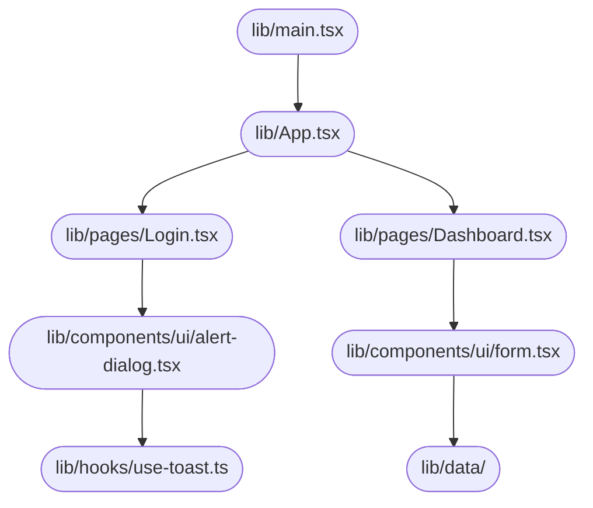

# Design Documentation — jahnavi783/tasty-web-portal

**Generated:** 2026-04-08T11:11:41
**Branch:** main

## Repository Description
## Overview
A TypeScript + React web application that serves as a user interface for managing various features.

## Description
* **Core Product:** The application manages multiple features, including user authentication, dashboard views, and data visualization.
* **Problem Solved:** It eliminates the need for manual data entry and provides an intuitive interface for users to interact with their data.
* **Key Features:** user authentication, dashboard views, data visualization, form management, and toast notifications.
* **Entry Point:** The main file that initializes the app is `src/main.tsx`.

## What the Codebase Does
* **Entry Point:** The application starts at `src/main.tsx`, which imports and renders the App component from `src/App.tsx`.
* **Core Feature – Authentication:** User authentication is handled by the `Login` and `Signup` pages in `src/pages/`.
* **User Flow:** Users can navigate between different features using the navigation menu, including accessing their dashboard views.
* **Data Layer:** The application uses React Query to manage data fetching and caching for various components.
* **Output:** Toast notifications are displayed when certain events occur, such as form submission or errors.

## System Overview
* `src/App.tsx` — The main App component that renders the entire application.
* `src/pages/` — Folder containing pages for user authentication, dashboard views, and other features.
* `src/components/` — Folder containing reusable UI components used throughout the application.
* `src/hooks/` — Folder containing custom hooks for managing data fetching and caching.

## Codebase Structure
* **`src/`** — The root folder of the project, containing the main App component and various subfolders for pages, components, and hooks.
* **`src/pages/`** — Folder containing pages for user authentication, dashboard views, and other features.
* **`src/components/`** — Folder containing reusable UI components used throughout the application.
* **`src/hooks/`** — Folder containing custom hooks for managing data fetching and caching.



## Architecture
## Architecture

### High-Level Design
* **Pattern:** Clean Architecture - This pattern separates the application logic into layers, with the presentation layer (UI) at the top and the data storage layer at the bottom.
* **Structure:** The repository is structured to reflect this pattern, with the `src` folder containing the business logic, services, and repositories, while the `public` folder holds static assets like images and stylesheets.
* **State Management:** No explicit state management approach is used; instead, React's built-in context API and hooks are leveraged for managing application state.

### Key Components
* **`src/App.tsx`** — The main entry point of the application, responsible for rendering the UI components.
* **`src/components/ui/*`** — A collection of reusable UI components, including buttons, forms, and navigation menus.
* **`src/services/*`** — Modules that encapsulate business logic and interact with external APIs or data storage.

### Component Interactions
* **Request Flow:** When a user interacts with the application (e.g., clicks a button), the event is handled by the corresponding UI component. The component then dispatches an action to the `src/services/*` modules, which perform the necessary business logic and interact with external APIs or data storage.
* **Data Direction:** Responses from the services are then propagated back up the layers, eventually reaching the UI components, which update their state accordingly.
* **Shared Services:** The `src/lib/utils.ts` module provides utility functions that can be used across multiple features.

### Entry Points
* **Main Entry:** **`src/App.tsx`** — This file is executed at startup and initializes the React application.
* **App Init:** **`src/main.tsx`** — This file sets up the React app framework and widget tree.
* **Routing:** No explicit routing module is present; instead, React Router is used within the `src/App.tsx` file to manage navigation.

## API Information
### Work Orders

* **GET /work-orders** — Retrieves a list of all work orders
* **POST /work-orders** — Creates a new work order with provided details
* **GET /work-orders/{id}** — Retrieves a specific work order by ID
* **PUT /work-orders/{id}** — Updates an existing work order with provided details
* **DELETE /work-orders/{id}** — Deletes a specific work order by ID

### Engineers

* **GET /engineers** — Retrieves a list of all engineers
* **POST /engineers** — Creates a new engineer account with provided details
* **GET /engineers/{id}** — Retrieves a specific engineer's profile by ID
* **PUT /engineers/{id}** — Updates an existing engineer's profile with provided details
* **DELETE /engineers/{id}** — Deletes a specific engineer's account by ID

### Customers

* **GET /customers** — Retrieves a list of all customers
* **POST /customers** — Creates a new customer account with provided details
* **GET /customers/{id}** — Retrieves a specific customer's profile by ID
* **PUT /customers/{id}** — Updates an existing customer's profile with provided details
* **DELETE /customers/{id}** — Deletes a specific customer's account by ID

### Login and Authentication

* **POST /login** — Authenticates user credentials and returns a session token
* **GET /logout** — Invalidates the current user's session and logs them out

### Miscellaneous

* **GET /health-check** — Returns server health status (e.g., "OK" or error message)

## Data Flow
Here is the documented data flow for the `tasty-web-portal` repository:

### Data Models
* **`Recipe`:** id, name, description, ingredients, instructions. Represents a recipe with its metadata and content.
* **`User`:** id, username, email, password. Stores user account information.
* **`Order`:** id, userId, orderDate, status. Tracks orders placed by users.

### Data Flow Description

1. **UI Layer:** The user navigates to the "Recipes" page or submits a new recipe form, triggering a BLoC event to fetch or create data.
2. **State/Logic Layer:** The `RecipeBloc` handles the event and dispatches an action to retrieve or create recipes from the service layer.
3. **Service Layer:** The `RecipeService` processes the request by calling the `getRecipes()` or `createRecipe()` method, which interacts with the repository layer.
4. **API/Network Layer:** The API call made is a GET request to `/api/recipes` or a POST request to `/api/recipes`.
5. **Repository Layer:** The response from the service layer is parsed and returned as a list of `Recipe` objects or a single `Recipe` object, respectively.
6. **State Update:** The UI is updated with the new data by dispatching an event to update the recipe list or displaying the newly created recipe.

### Storage
* **`SQLite`:** Stores user account information (User model) and order history (Order model).
* **`SharedPreferences`:** Stores user authentication tokens for offline access.
* **`REST API`:** Exposes endpoints for retrieving recipes, creating new recipes, and managing orders.

## Tech Stack
- Languages: TypeScript (React)  77.0%, JSON  8.1%, TypeScript  8.1%, JavaScript  2.7%, CSS  2.7%, HTML  1.4%
- Frameworks: Unknown

## Code Quality Metrics
```json
[{'metric': 'Total Project Files', 'value': '80', 'status': 'ℹ️ Info'}, {'metric': 'Primary Language', 'value': 'TypeScript  96.9%  (63 files)', 'status': '✅ Good'}, {'metric': 'Test Files', 'value': '1', 'status': '⚠️ Average'}, {'metric': 'Test / Lint / Build', 'value': 'test=0%, lint=100%, build=100%', 'status': '✅ Good'}, {'metric': 'Dependencies', 'value': '49 prod, 17 dev  (package.json)', 'status': 'ℹ️ Info'}, {'metric': 'Dockerfile Present', 'value': 'No', 'status': '⚠️ Average'}]
```