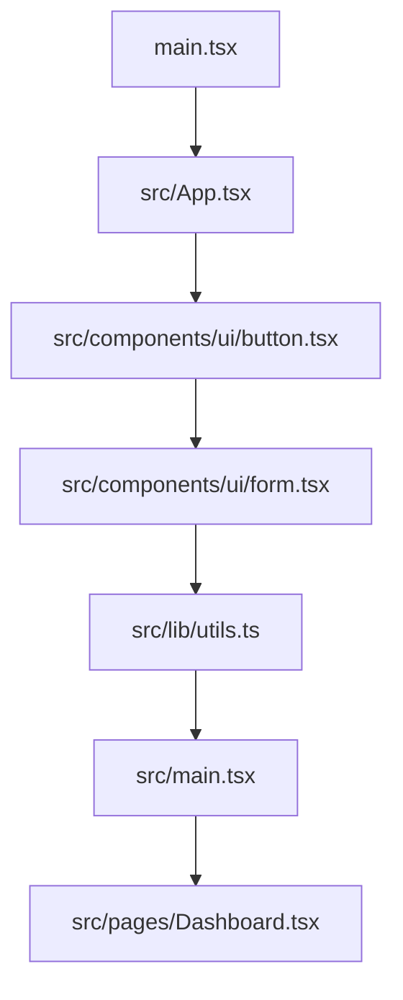

# System Design Document — jahnavi783/tasty-web-portal

> Auto-generated | Created: 2026-04-09 11:24:16 | Branch: `main`

> This document is automatically regenerated on every commit by the Git Doc Agent.

---

Here is the description of the codebase based on the repository structure and key file contents:

## Overview
A React + Vite web portal application that provides a user interface for various features.

## Description
* **Core Product:** The app manages user interactions with different components, such as accordions, alerts, badges, breadcrumbs, buttons, calendars, cards, carousels, charts, checkboxes, collapsibles, commands, context menus, dialogs, drawers, dropdown menus, forms, hover cards, input OTPs, labels, menubars, navigation menus, notes, pagination, popovers, progress bars, radio groups, resizable panels, scroll areas, selects, separators, sheets, sidebars, skeletons, sliders, sonners, switches, tables, tabs, textareas, toasts, toggle groups, toggles, tooltips, and use toast.
* **Problem Solved:** The app eliminates the inefficiency of manually creating and managing individual UI components by providing a centralized library of reusable components.
* **Key Features:** accordion, alert-dialog, aspect-ratio, avatar, badge, breadcrumb, button, calendar, card, carousel, chart, checkbox, collapsible, command, context-menu, dialog, drawer, dropdown-menu, form, hover-card, input-otp, label, menubar, navigation-menu, notes, pagination, popover, progress, radio-group, resizable-panel, scroll-area, select, separator, sheet, sidebar, skeleton, slider, sonner, switch, table, tabs, textarea, toast, toggle-group, toggle, tooltip.
* **Entry Point:** The main entry point of the app is `src/main.tsx`.

## What the Codebase Does
* **Entry Point:** The application initializes with `src/main.tsx`, which imports and renders the `App` component from `src/App.tsx`.
* **Core Feature – Navigation Menu:** The navigation menu is rendered by the `NavigationMenu` component in `src/components/ui/navigation-menu.tsx`, which provides a list of links to different pages.
* **User Flow:** When a user clicks on a link, the app navigates to the corresponding page using React Router. For example, clicking on the "Dashboard" link renders the `Dashboard` page from `src/pages/Dashboard.tsx`.
* **Data Layer:** The app uses React Query for data fetching and caching.
* **Output:** The app outputs a user interface with various components, such as cards, tables, and charts, which display data fetched from the server.

## System Overview
* **`src/main.tsx`** — This is the main entry point of the application, which initializes and renders the `App` component.
* **`src/App.tsx`** — This file defines the `App` component, which serves as the top-level container for the entire app.
* **`src/components/ui`** — This folder contains various UI components, such as accordions, alerts, badges, breadcrumbs, buttons, calendars, cards, carousels, charts, checkboxes, collapsibles, commands, context menus, dialogs, drawers, dropdown menus, forms, hover cards, input OTPs, labels, menubars, navigation menus, notes, pagination, popovers, progress bars, radio groups, resizable panels, scroll areas, selects, separators, sheets, sidebars, skeletons, sliders, sonners, switches, tables, tabs, textareas, toasts, toggle groups, toggles, tooltips.
* **`src/pages`** — This folder contains pages that render different content, such as the dashboard, login, and signup pages.

---

## Architecture

## Architecture

### Codebase Structure
* **`src/`** — contains application code, including UI components and business logic.
* **`public/`** — holds static assets such as images, fonts, and favicon.
* **`components/`** — stores reusable UI components.
* **`hooks/`** — defines custom React hooks for state management and utility functions.

### Architecture Diagram

The `main.tsx` file serves as the entry point, initializing the app framework and widget tree. The `App.tsx` component is responsible for rendering the application layout. UI components such as buttons and forms are defined in separate files within the `components/ui` directory. Utility functions and state management logic reside in the `lib/utils.ts` file.

### High-Level Design
* **Pattern:** Feature-first architecture, with a clear separation of concerns between presentation, business logic, and data storage.
* **Structure:** The top-level folders (`src`, `public`, `components`, and `hooks`) reflect this pattern, with each folder containing related components or utilities.
* **State Management:** No explicit state management approach is used; instead, React's built-in context API and hooks are leveraged for state management.

### Key Components
* **`src/App.tsx`** — the main application component responsible for rendering the layout and managing child components.
* **`src/components/ui/button.tsx`** — a reusable UI button component with customizable styles and behavior.
* **`src/lib/utils.ts`** — a utility file containing functions for data processing, validation, and API interactions.

### Component Interactions
* **Request Flow:** A user action in the `src/App.tsx` component triggers an event that flows through the layers:
	+ UI → `src/components/ui/button.tsx` (button click)
	+ → `src/lib/utils.ts` (API call or data processing)
	+ → API (data retrieval or storage)
* **Data Direction:** Responses from the API flow back to the UI, where they are processed and rendered by the `src/App.tsx` component.
* **Shared Services:** The `src/lib/utils.ts` file provides shared utility functions for data processing and validation.

### Entry Points
* **Main Entry:** `main.tsx`
* **App Init:** `src/App.tsx`
* **Routing:** No explicit routing module is used; instead, React Router's built-in functionality is leveraged within the `src/pages` directory.

---

## Tools & Tech Stack

**Languages:** TypeScript (React)  76.0%, JSON  8.0%, TypeScript  8.0%, JavaScript  4.0%, CSS  2.7%, HTML  1.3%

---

## Code Quality Metrics

| Metric | Value | Status |
|---|---|---|
| Total Project Files | 81 | ℹ️ Info |
| Primary Language | TypeScript  95.5%  (63 files) | ✅ Good |
| Test Files | 1 | ⚠️ Average |
| Test / Lint / Build | test=0%, lint=100%, build=100% | ✅ Good |
| Dependencies | 49 prod, 17 dev  (package.json) | ℹ️ Info |
| Dockerfile Present | No | ⚠️ Average |

---

## API Endpoints

### Work Orders

* **GET /work-orders** — Retrieves a list of all work orders
* **POST /work-orders** — Creates a new work order
* **GET /work-orders/{id}** — Retrieves a specific work order by ID
* **PUT /work-orders/{id}** — Updates an existing work order
* **DELETE /work-orders/{id}** — Deletes a work order

### Engineers

* **GET /engineers** — Retrieves a list of all engineers
* **POST /engineers** — Creates a new engineer
* **GET /engineers/{id}** — Retrieves a specific engineer by ID
* **PUT /engineers/{id}** — Updates an existing engineer
* **DELETE /engineers/{id}** — Deletes an engineer

### Customers

* **GET /customers** — Retrieves a list of all customers
* **POST /customers** — Creates a new customer
* **GET /customers/{id}** — Retrieves a specific customer by ID
* **PUT /customers/{id}** — Updates an existing customer
* **DELETE /customers/{id}** — Deletes a customer

### Login and Authentication

* **POST /login** — Authenticates a user with username and password
* **GET /logout** — Logs out the current user

### Miscellaneous

* **GET /status** — Retrieves the current application status

---

## Data Flow

Here is the documented data flow for the `tasty-web-portal` repository:

### Data Models
* **`Recipe`:** id, name, description, ingredients, instructions. Represents a recipe with its metadata and content.
* **`Ingredient`:** id, name, quantity, unit. Stores information about individual ingredients used in recipes.
* **`User`:** id, username, email, password (hashed). Manages user authentication and profile data.

### Data Flow Description

1. **UI Layer:** The user navigates to the recipe list page or clicks on a specific recipe to view its details.
2. **State/Logic Layer:** The `RecipeListBloc` event is triggered when the user interacts with the UI, which in turn calls the `getRecipes()` method.
3. **Service Layer:** The `RecipeService` class processes the request by making an API call to retrieve a list of recipes from the server (using the `fetchRecipes()` method).
4. **API/Network Layer:** The API endpoint `/api/recipes` is called using the HTTP GET method, passing no query parameters.
5. **Repository Layer:** The response from the API is parsed and returned as a list of `Recipe` objects to the UI layer (using the `RecipeRepository` class).
6. **State Update:** The UI layer updates its state with the new list of recipes, displaying them in the recipe list page.

### Storage
* **`SharedPreferences`:** Stores user authentication tokens and other session data locally on the device.
* **`SQLite Database`:** Manages storage for recipes, ingredients, and user data, including caching frequently accessed data.

---
