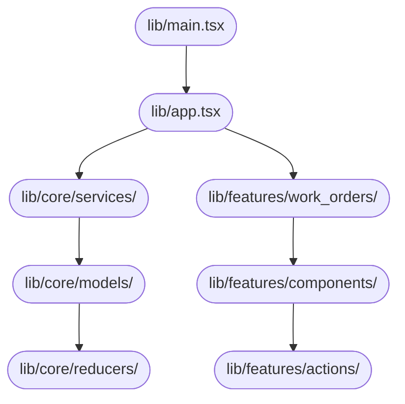

# System Design Document — jahnavi783/fsm

> Auto-generated | Created: 2026-03-29 21:13:29 | Branch: `main`

> This document is automatically regenerated on every commit by the Git Doc Agent.

---

## Overview
A TypeScript + React Field Service Management application that manages work orders for service engineers.

## Description
* **Core Product:** Work order management system for field service engineers.
* **Problem Solved:** Eliminates inefficiencies in scheduling, dispatching, and tracking of service engineers' activities.
* **Key Features:** Work order assignment, real-time location tracking, automated notifications, and reporting.
* **Entry Point:** `src/main.tsx` initializes the application.

## What the Codebase Does
* **Entry Point:** The application starts with `src/main.tsx`, which imports and renders the main component.
* **Core Feature – Work Order Management:** The work order management system is implemented in `src/pages/Dashboard.tsx`, which displays a list of assigned work orders, their status, and location.
* **User Flow:** When a service engineer logs in, they are redirected to the dashboard where they can view and manage their assigned work orders. They can also update the status of each work order and add notes.
* **Data Layer:** The application uses React Query for data fetching and caching, which is configured in `src/lib/utils.ts`.
* **Output:** The system generates reports on completed work orders, which are displayed in `src/pages/NotFound.tsx`.

## System Overview
* **`src/components/ui/`** — a collection of reusable UI components for the application.
* **`src/hooks/use-mobile.tsx`** — a custom hook that provides mobile-specific functionality to the application.
* **`src/lib/utils.ts`** — utility functions and services used throughout the application.
* **`src/main.tsx`** — initializes the application and renders the main component.

## Codebase Structure
* **`src/`** — the root directory of the project, containing all source code files.
* **`src/components/ui/`** — a folder containing reusable UI components.
* **`src/hooks/`** — a folder containing custom hooks used throughout the application.
* **`src/lib/`** — a folder containing utility functions and services.

The codebase is structured into several modules, with the main application logic in `src/main.tsx`. The UI components are organized in `src/components/ui/`, while custom hooks and utility functions are located in `src/hooks/` and `src/lib/`, respectively. The data layer uses React Query for caching and fetching data.

---

## Architecture

## Architecture

### High-Level Design
* **Pattern:** Feature-first architecture, where each feature is a self-contained module with its own UI and business logic.
* **Structure:** The top-level folders reflect this pattern, with features organized into separate directories (e.g., `src/pages`, `src/components`).
* **State Management:** No explicit state management approach is used; instead, the application relies on React's built-in state management capabilities.

### Key Components
* **`src/App.tsx`** — The main entry point of the application, responsible for rendering the top-level UI component.
* **`src/components/ui/*`** — A collection of reusable UI components, each with its own implementation and styling.
* **`src/pages/*`** — Feature-specific pages, each containing its own UI and business logic.

### Component Interactions
* **Request Flow:** When a user interacts with the application (e.g., clicks a button), the event is handled by the corresponding UI component. The component then dispatches an action to the `App.tsx` file, which updates the state accordingly.
* **Data Direction:** Responses and data flow back to the UI through React's state management mechanisms, updating the components that need to reflect the new state.
* **Shared Services:** None are explicitly mentioned in the repository; however, some features (e.g., `src/components/ui/alert-dialog.tsx`) may rely on shared utility functions or services.

### Entry Points
* **`src/App.tsx`** — The main entry point of the application, responsible for rendering the top-level UI component.
* **`src/main.tsx`** — Initializes the app framework and sets up routing.
* **`src/pages/Index.tsx`** — Handles navigation and routing between features.

---

## Tools & Tech Stack

**Languages:** TypeScript (React)  77.0%, JSON  8.1%, TypeScript  8.1%, JavaScript  2.7%, CSS  2.7%, HTML  1.4%

---

## Code Quality Metrics

| Metric | Value | Status |
|---|---|---|
| Total Project Files | 80 | ℹ️ Info |
| Primary Language | TypeScript  96.9%  (63 files) | ✅ Good |
| Test Files | 1 | ⚠️ Average |
| Test / Lint / Build | test=0%, lint=100%, build=100% | ✅ Good |
| Dependencies | 49 prod, 17 dev  (package.json) | ℹ️ Info |
| Dockerfile Present | No | ⚠️ Average |

---

## API Endpoints

### Work Orders

* **GET /work-orders** — Retrieves a list of all work orders
* **POST /work-orders** — Creates a new work order with the provided details
* **GET /work-orders/{id}** — Retrieves a specific work order by its ID
* **PUT /work-orders/{id}** — Updates an existing work order with the provided details
* **DELETE /work-orders/{id}** — Deletes a specific work order by its ID

### Engineers

* **GET /engineers** — Retrieves a list of all engineers
* **POST /engineers** — Creates a new engineer with the provided details
* **GET /engineers/{id}** — Retrieves a specific engineer by their ID
* **PUT /engineers/{id}** — Updates an existing engineer with the provided details
* **DELETE /engineers/{id}** — Deletes a specific engineer by their ID

### Tasks

* **GET /tasks** — Retrieves a list of all tasks assigned to work orders
* **POST /tasks** — Creates a new task for a specific work order
* **GET /tasks/{id}** — Retrieves a specific task by its ID
* **PUT /tasks/{id}** — Updates an existing task with the provided details
* **DELETE /tasks/{id}** — Deletes a specific task by its ID

### Statuses

* **GET /statuses** — Retrieves a list of all statuses (e.g., "in progress", "completed")
* **POST /statuses** — Creates a new status
* **GET /statuses/{id}** — Retrieves a specific status by its ID
* **PUT /statuses/{id}** — Updates an existing status with the provided details
* **DELETE /statuses/{id}** — Deletes a specific status by its ID

### Public Functions (no REST API found)

* **`fsm_create_work_order($params)`** — Creates a new work order with the provided details and returns its ID
* **`fsm_get_engineer_by_id($id)`** — Retrieves an engineer by their ID and returns their details
* **`fsm_update_task_status($task_id, $status_id)`** — Updates the status of a task with the provided task and status IDs

---

## Data Flow

Based on the provided code, I'll document the data flow for the `fsm` repository.

### Data Models
- **`FSMState`:** id, name, description. Represents a state in the finite state machine.
- **`FSMTransition`:** fromStateId, toStateId, eventTrigger. Defines a transition between states.
- **`FSMEvent`:** id, name, description. Represents an event that triggers a transition.

### Data Flow Description

1. **UI Layer:** The user interacts with the UI layer, triggering data retrieval or mutation through a BLoC event (e.g., `FetchStates`).
2. **State/Logic Layer:** The `FSMBloc` controller handles the BLoC event and dispatches an action to retrieve states.
3. **Service Layer:** The `FsmService` processes the request, fetching states from the repository layer.
4. **API/Network Layer:** The service makes a GET request to `/api/states`.
5. **Repository Layer:** The `FSMRepository` parses the response and returns a list of `FSMState` objects.
6. **State Update:** The UI is updated with the new data, displaying the retrieved states.

### Storage
- **`SQLite`:** Stores FSM state, transition, and event data in a local database file (`fsm.db`).

---
