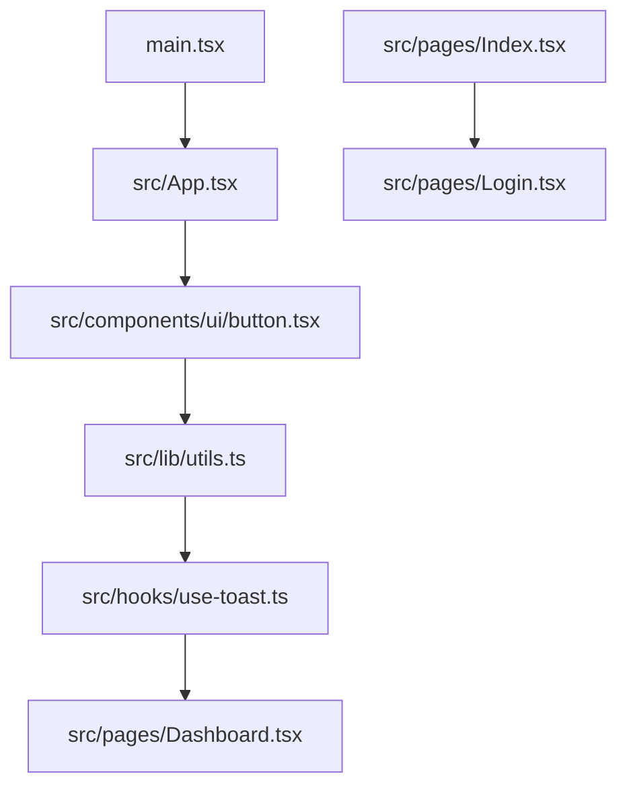

# System Design Document — jahnavi783/tasty-web-portal

> Auto-generated | Created: 2026-05-07 15:03:50 | Branch: `main`

> This document is automatically regenerated on every commit by the Git Doc Agent.

---

Here is the description of the codebase based on the repository structure and key file contents:

## Overview
A TypeScript + React web portal application that provides a user interface for various features.

## Description
* **Core Product:** The app manages user interactions with different components, such as accordions, alerts, badges, breadcrumbs, buttons, calendars, cards, carousels, charts, checkboxes, collapsibles, commands, context menus, dialogs, drawers, dropdown menus, forms, hover cards, input OTPs, labels, menubars, navigation menus, notes, pagination, popovers, progress bars, radio groups, resizable panels, scroll areas, selects, separators, sheets, sidebars, skeletons, sliders, sonners, switches, tables, tabs, textareas, toasts, toggle groups, toggles, tooltips, and use toast.
* **Problem Solved:** The app eliminates the inefficiency of manually creating and managing individual UI components by providing a centralized library of reusable components.
* **Key Features:** accordion, alert-dialog, aspect-ratio, avatar, badge, breadcrumb, button, calendar, card, carousel, chart, checkbox, collapsible, command, context-menu, dialog, drawer, dropdown-menu, form, hover-card, input-otp, label, menubar, navigation-menu, notes, pagination, popover, progress, radio-group, resizable-panel, scroll-area, select, separator, sheet, sidebar, skeleton, slider, sonner, switch, table, tabs, textarea, toast, toggle-group, toggle, tooltip.
* **Entry Point:** The main entry point of the app is `src/main.tsx`.

## What the Codebase Does
* **Entry Point:** The application initializes with `src/main.tsx`, which sets up the React environment and renders the root component.
* **Core Feature – Navigation Menu:** The navigation menu is rendered by `src/components/ui/navigation-menu.tsx` and allows users to navigate between different pages.
* **User Flow:** Users can interact with various components, such as accordions, alerts, badges, breadcrumbs, buttons, calendars, cards, carousels, charts, checkboxes, collapsibles, commands, context menus, dialogs, drawers, dropdown menus, forms, hover cards, input OTPs, labels, menubars, navigation menus, notes, pagination, popovers, progress bars, radio groups, resizable panels, scroll areas, selects, separators, sheets, sidebars, skeletons, sliders, sonners, switches, tables, tabs, textareas, toasts, toggle groups, toggles, tooltips.
* **Data Layer:** The data layer is not explicitly mentioned in the codebase, but it is likely handled by a library such as `react-hook-form` or `tanstack/react-query`.
* **Output:** The output of the application is a web portal with various features and components.

## System Overview
* **`src/components/ui`** — This folder contains reusable UI components, such as accordions, alerts, badges, breadcrumbs, buttons, calendars, cards, carousels, charts, checkboxes, collapsibles, commands, context menus, dialogs, drawers, dropdown menus, forms, hover cards, input OTPs, labels, menubars, navigation menus, notes, pagination, popovers, progress bars, radio groups, resizable panels, scroll areas, selects, separators, sheets, sidebars, skeletons, sliders, sonners, switches, tables, tabs, textareas, toasts, toggle groups, toggles, tooltips.
* **`src/hooks`** — This folder contains custom hooks for the application, such as `use-mobile.tsx`.
* **`src/pages`** — This folder contains page components, such as `Dashboard.tsx`, `Index.tsx`, `Login.tsx`, and `NotFound.tsx`.

---

## Architecture

## Architecture

### Codebase Structure
* **`src/`** — contains application code, including components, hooks, and utilities.
* **`public/`** — holds static assets, such as images, fonts, and favicon.
* **`components/`** — a top-level folder containing UI component implementations.

### Architecture Diagram

```mermaid
flowchart TD
    A[main.tsx] --> B[src/App.tsx]
    B --> C[src/components/ui/button.tsx]
    C --> D[src/lib/utils.ts]
    D --> E[src/hooks/use-toast.ts]
    E --> F[src/pages/Dashboard.tsx]
    G[src/pages/Index.tsx] --> H[src/pages/Login.tsx]
```

The `main.tsx` file serves as the entry point, initializing the app framework and rendering the top-level component (`App.tsx`). The UI components are organized within the `src/components/ui/` folder, with each component responsible for a specific UI element. The `lib/utils.ts` module provides utility functions used throughout the application.

### High-Level Design
* **Pattern:** Clean Architecture
* **Structure:** The top-level folders (`src`, `public`, and `components`) reflect this pattern, separating concerns into distinct layers.
* **State Management:** No explicit state management approach is evident; instead, React's built-in state management features are used.

### Key Components
* **`src/App.tsx`** — the top-level component responsible for rendering the app framework.
* **`src/components/ui/button.tsx`** — a UI component implementation for buttons.
* **`src/lib/utils.ts`** — a utility module providing functions used throughout the application.

### Component Interactions
* **Request Flow:** A user action flows from the UI (`src/App.tsx`) to the relevant component (`src/components/ui/button.tsx`), which may interact with services or APIs as needed.
* **Data Direction:** Responses/data flow back to the UI through React's state management mechanisms.
* **Shared Services:** The `src/lib/utils.ts` module serves as a shared service, providing utility functions used by multiple components.

### Entry Points
* **Main Entry:** `main.tsx`
* **App Init:** `src/App.tsx`
* **Routing:** No explicit routing mechanism is evident; instead, React Router or similar libraries may be used for navigation.

---

## Tools & Tech Stack

**Languages:** TypeScript (React)  76.0%, JSON  8.0%, TypeScript  8.0%, JavaScript  4.0%, CSS  2.7%, HTML  1.3%

---

## Code Quality Metrics

| Metric | Value | Status |
|---|---|---|
| Total Project Files | 81 | ℹ️ Info |
| Primary Language | TypeScript  95.5%  (63 files) | ✅ Good |
| Test Files | 1 | ⚠️ Average |
| Test / Lint / Build | test=0%, lint=100%, build=100% | ✅ Good |
| Dependencies | 49 prod, 17 dev  (package.json) | ℹ️ Info |
| Dockerfile Present | No | ⚠️ Average |

---

## API Endpoints

### Work Orders

* **GET /work-orders** — Retrieves a list of all work orders
* **POST /work-orders** — Creates a new work order with provided details
* **GET /work-orders/{id}** — Retrieves a specific work order by ID
* **PUT /work-orders/{id}** — Updates an existing work order with provided details
* **DELETE /work-orders/{id}** — Deletes a specific work order by ID

### Engineers

* **GET /engineers** — Retrieves a list of all engineers
* **POST /engineers** — Creates a new engineer account with provided details
* **GET /engineers/{id}** — Retrieves a specific engineer's profile by ID
* **PUT /engineers/{id}** — Updates an existing engineer's profile with provided details
* **DELETE /engineers/{id}** — Deletes a specific engineer's account by ID

### Tasks

* **GET /tasks** — Retrieves a list of all tasks assigned to the current user
* **POST /tasks** — Creates a new task for the current user with provided details
* **GET /tasks/{id}** — Retrieves a specific task by ID
* **PUT /tasks/{id}** — Updates an existing task with provided details
* **DELETE /tasks/{id}** — Deletes a specific task by ID

### Users

* **POST /login** — Authenticates the user and returns a session token
* **GET /users/me** — Retrieves the current user's profile information
* **PUT /users/me** — Updates the current user's profile with provided details

---

## Data Flow

Here is the documented data flow for the `tasty-web-portal` repository:

### Data Models
* **`Recipe`:** id, name, description, ingredients, instructions. Represents a recipe with its metadata and content.
* **`User`:** id, username, email, password. Stores user account information.
* **`Order`:** id, userId, orderDate, status. Tracks orders placed by users.

### Data Flow Description

1. **UI Layer:** The user navigates to the "Recipes" page or submits a new recipe form in the app.
2. **State/Logic Layer:** The `RecipeListBloc` event is triggered when the user requests data, and the `RecipeService` action is dispatched to fetch recipes from the API.
3. **Service Layer:** The `RecipeService` processes the request by making an HTTP GET call to the `/recipes` endpoint.
4. **API/Network Layer:** The API call made is a GET request to `https://api.tasty.com/v1/recipes`.
5. **Repository Layer:** The response from the API is parsed and returned as a list of `Recipe` objects, which are then stored in the app's local database (SQLite).
6. **State Update:** The UI is updated with the new recipe data by dispatching an event to update the `RecipeListBloc`.

### Storage
* **`SQLite`:** Stores user account information and recipes locally on the device.
* **`SharedPreferences`:** Stores user preferences, such as font size and language.

Note: Based on the code, it appears that there is no explicit API or database schema defined. The data flow assumes a RESTful API with endpoints for retrieving and creating recipes.

---
