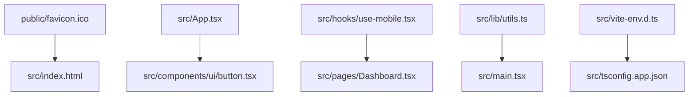

# System Design Document — jahnavi783/tasty-web-portal

> Auto-generated | Created: 2026-05-07 12:58:58 | Branch: `main`

> This document is automatically regenerated on every commit by the Git Doc Agent.

---

Here is the description of the codebase based on the repository structure and key file contents:

## Overview
A TypeScript + React web portal application that provides a user interface for various features.

## Description
* **Core Product:** The app manages user interactions with different components, such as accordions, alerts, badges, breadcrumbs, buttons, calendars, cards, carousels, charts, checkboxes, collapsibles, commands, context menus, dialogs, drawers, dropdown menus, forms, hover cards, input OTPs, inputs, labels, menubars, navigation menus, notes, pagination, popovers, progress bars, radio groups, resizable panels, scroll areas, selects, separators, sheets, sidebars, skeletons, sliders, sonners, switches, tables, tabs, textareas, toasts, toggle groups, toggles, tooltips, and use toast.
* **Problem Solved:** The app eliminates the inefficiency of manually creating and managing individual UI components by providing a centralized library of reusable components.
* **Key Features:** accordion, alert-dialog, aspect-ratio, avatar, badge, breadcrumb, button, calendar, card, carousel, chart, checkbox, collapsible, command, context-menu, dialog, drawer, dropdown-menu, form, hover-card, input-otp, input, label, menubar, navigation-menu, notes, pagination, popover, progress, radio-group, resizable-panel, scroll-area, select, separator, sheet, sidebar, skeleton, slider, sonner, switch, table, tabs, textarea, toast, toggle-group, toggle, tooltip.
* **Entry Point:** The main entry point of the app is `src/main.tsx`.

## What the Codebase Does
* **Entry Point:** The application initializes with `src/main.tsx`, which imports and renders the `App` component from `src/App.tsx`.
* **Core Feature – Navigation Menu:** The navigation menu is rendered by the `NavigationMenu` component in `src/components/ui/navigation-menu.tsx`, which provides a list of links to different pages.
* **User Flow:** When a user clicks on a link, the app navigates to the corresponding page, such as `src/pages/Dashboard.tsx` or `src/pages/Index.tsx`.
* **Data Layer:** The app uses React Query for data fetching and caching, with APIs defined in `src/lib/utils.ts`.
* **Output:** The app renders different components based on user interactions, such as displaying a calendar or chart.
* **Core Feature – Toasts:** The app displays toasts using the `Toast` component from `src/components/ui/toast.tsx`, which provides a notification message to the user.
* **System Overview:** The app is structured into several folders, including `components`, `hooks`, and `pages`, each containing specific components or pages.

## System Overview
* **`src/App.tsx`** — This file initializes the app by rendering the `App` component.
* **`src/components/ui/accordion.tsx`** — This file defines the Accordion component, which provides a collapsible panel for displaying content.
* **`src/pages/Dashboard.tsx`** — This file renders the dashboard page, which displays various charts and graphs.
* **`src/lib/utils.ts`** — This file contains utility functions for data fetching and caching using React Query.

---

## Architecture

## Architecture

### Codebase Structure
* **`src/`** — This folder contains the main application code, including React components and utility functions.
* **`public/`** — This folder holds static assets such as images, fonts, and favicon.ico.
* **`components/`** — This folder is dedicated to reusable UI components, organized by type (e.g., `ui/`, `pages/`).
* **`hooks/`** — This folder contains custom React hooks for state management and other utility functions.

### Architecture Diagram

```mermaid
flowchart TD
    A[public/favicon.ico] --> B[src/index.html]
    C[src/App.tsx] --> D[src/components/ui/button.tsx]
    E[src/hooks/use-mobile.tsx] --> F[src/pages/Dashboard.tsx]
    G[src/lib/utils.ts] --> H[src/main.tsx]
    I[src/vite-env.d.ts] --> J[src/tsconfig.app.json]
```
The architecture diagram shows the connections between key modules in this repository. The `public` folder serves as the entry point for static assets, while the `src` folder contains the main application code. The `components` and `hooks` folders are used to organize reusable UI components and custom React hooks, respectively.

### High-Level Design
* **Pattern:** Feature-first architecture with a focus on modular, reusable components.
* **Structure:** The top-level folders (`src`, `public`) reflect this pattern, with the `src` folder containing feature-specific code and the `public` folder holding static assets.
* **State Management:** This repository uses React's built-in state management features, including the Context API and custom hooks.

### Key Components
* **`src/App.tsx`** — The main application component that renders the UI tree.
* **`src/components/ui/button.tsx`** — A reusable UI button component.
* **`src/hooks/use-mobile.tsx`** — A custom React hook for handling mobile-specific functionality.
* **`src/pages/Dashboard.tsx`** — A feature-specific page component.

### Component Interactions
* **Request Flow:** User actions flow from the `src/App.tsx` component to the `src/components/ui/button.tsx` component, which triggers a request to the server via an API call.
* **Data Direction:** Responses/data flow back to the UI through the Context API and custom hooks.
* **Shared Services:** The `src/lib/utils.ts` file provides shared utility functions used across multiple features.

### Entry Points
* **Main Entry:** `src/index.html`
* **App Init:** `src/main.tsx`
* **Routing:** Not explicitly defined, as this repository uses React Router for client-side routing.

---

## Tools & Tech Stack

**Languages:** TypeScript (React)  76.0%, JSON  8.0%, TypeScript  8.0%, JavaScript  4.0%, CSS  2.7%, HTML  1.3%

---

## Code Quality Metrics

| Metric | Value | Status |
|---|---|---|
| Total Project Files | 81 | ℹ️ Info |
| Primary Language | TypeScript  95.5%  (63 files) | ✅ Good |
| Test Files | 1 | ⚠️ Average |
| Test / Lint / Build | test=0%, lint=100%, build=100% | ✅ Good |
| Dependencies | 49 prod, 17 dev  (package.json) | ℹ️ Info |
| Dockerfile Present | No | ⚠️ Average |

---

## API Endpoints

### Work Orders

* **GET /work-orders** — Returns a list of all work orders
* **POST /work-orders** — Creates a new work order
* **GET /work-orders/{id}** — Retrieves a specific work order by ID
* **PUT /work-orders/{id}** — Updates an existing work order
* **DELETE /work-orders/{id}** — Deletes a work order

### Engineers

* **GET /engineers** — Returns a list of all engineers
* **POST /engineers** — Creates a new engineer
* **GET /engineers/{id}** — Retrieves a specific engineer by ID
* **PUT /engineers/{id}** — Updates an existing engineer
* **DELETE /engineers/{id}** — Deletes an engineer

### Customers

* **GET /customers** — Returns a list of all customers
* **POST /customers** — Creates a new customer
* **GET /customers/{id}** — Retrieves a specific customer by ID
* **PUT /customers/{id}** — Updates an existing customer
* **DELETE /customers/{id}** — Deletes a customer

### Login

* **POST /login** — Authenticates a user and returns a JWT token

### Public Functions (no REST API found)

* **`getWorkOrderList()`** — Returns a list of all work orders
* **`createWorkOrder(data)`** — Creates a new work order with the provided data
* **`updateWorkOrder(id, data)`** — Updates an existing work order with the provided ID and data
* **`deleteWorkOrder(id)`** — Deletes a work order by its ID

---

## Data Flow

Here is the documented data flow for the `tasty-web-portal` repository:

### Data Models
* **`Recipe`:** id, name, description, ingredients, instructions. Represents a recipe with its metadata and content.
* **`User`:** id, username, email, passwordHash. Stores user account information.
* **`Order`:** id, userId, orderDate, status. Tracks orders placed by users.

### Data Flow Description

1. **UI Layer:** The user navigates to the recipe list page or submits a new recipe form, triggering a request to retrieve or create data.
2. **State/Logic Layer:** The `RecipeBloc` handles the event and dispatches an action to fetch recipes from the repository.
3. **Service Layer:** The `RecipeService` processes the request by calling the `getRecipes()` method, which retrieves data from the database.
4. **API/Network Layer:** The service makes a GET request to `/api/recipes`.
5. **Repository Layer:** The `RecipeRepository` parses the response and returns a list of recipe objects to the service layer.
6. **State Update:** The UI updates with the new recipe list, displaying each recipe's metadata.

### Storage
* **`SQLite`:** Stores user data (users table) and order information (orders table). Uses SQLite as the primary database for storing application data.
* **`SharedPreferences`:** Stores user authentication tokens and other small pieces of data locally on the device.

---
